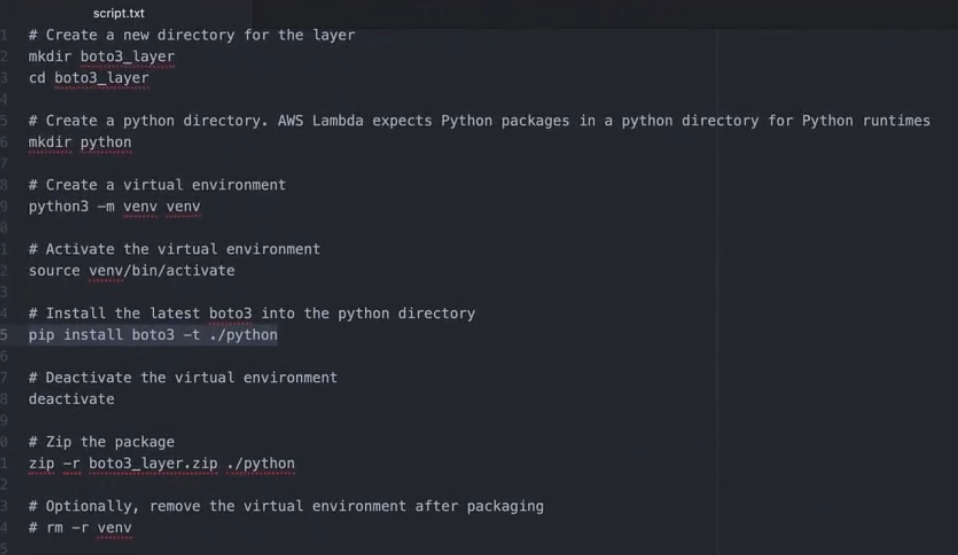

# Code Generation Project - Architecture :

- we're going to create API Gateway Endpoints (Enables us to call AWS as an API) , we use Restfox/Postman to call API Gateway.
- API GW trigger Lambda Function.
- Lambda Function calls the Bedrock API with the specific model we want to and it's going to get to a response back from the Bedrock Model and it's going to save it into S3.
- In this project , we're going to give instructions to Bedrock as to what kind of code it should produce in what programming language & save the output to s3.

## steps :

- Create a Lambda Function
  - Author From Scratch
    - name : bedrock_code_generation
    - runtime : python 3.11
    - Create Function
  - Give us Execution Role - which can be found in configuration TAB.
- Execution Role
  - Give it Administrator access , as this model is going to be talking with S3,Bedrock, monitoring with cloudwatch logs - Attach a Policy
  - In lambda code : create a bedrock client and invoke the model we want using becrock client along with passing body which contains prompt text and other config inputs for the model to consider while working & model responds back with code and then save that code in a s3 bucket & then lambda_handler get's the event and pass the message and language to bedrock func which takes care of calling model and getting back response and then the response is sent back to s3 and all of this is done by lambda function
- create s3 bucket and give that name in above lambda code to save our code
- API GW - build htto api - bedrock_course_api - add route - POST - /code_generation - intergrate lambda function as we want it to be called from this API GW Endpoint - Route_details - add integration - integration_type : lambda & setup(permission and region info) - now we can see the url in the API's section and we can deploy it to a stage by creating one - dev - deploy the api route to the dev stage and we can see url/dev
- testing the endpoint : go to postman : post - url/dev/code-generation - Body - {"key":Python,"message":generate binary search tree} - this body will be passed to lambda function and it takes care of calling model with prompt containing message and language we gave in body and then we see code generation complete as a response when we call the url with body and to validate - go to s3 - we see the bucket_name and inside code_output folder we see date_we_passed_event.py inside the code will be found which is generated by the model , initially there wouldn't be code generated as we don't have latest-versin of boto3 for us to call bedrock as it's so new.
- so we have to update boto3 to have the latest version for the lambda to call bedrock , so we add a layer to lambda function with latest boto3 version - Layers ( you can configure lambda function to use a additional code and content in the form of layers. where it's a zip archive and can contain libraries , a custom runtime or other dependencies ).
- create boto3 lambda layer : upload bot03_layer.zip created from below process into lambda layer - add runtime as above
  
