## what are vector embeddings?

- In Computer science & particularly in the field of ML & NLP , Vector Embeddings is a popular technique to represent information in a format that can be processed by algorithms, especially deep learning models.This 'information' can be text,pictures,video and audio.
- `Text Embeddings` - we can create a text embedding that will give us more information about our word such as it's meaning that computer can understand , a word will go from look like :
  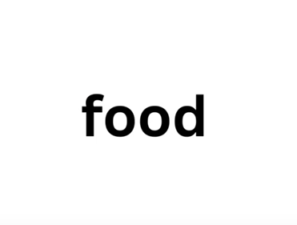
  - To this for computer
    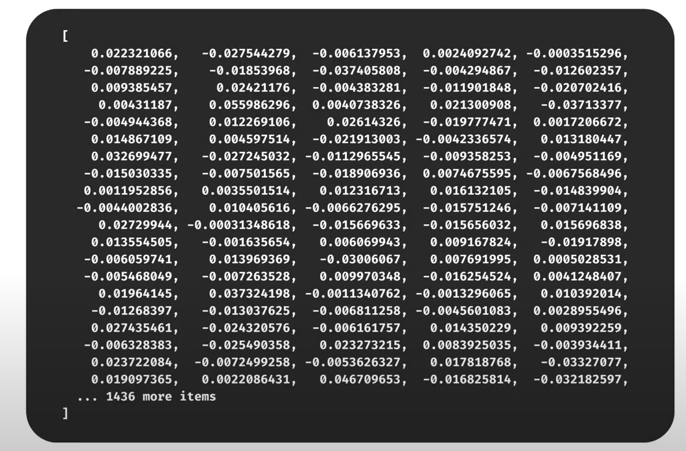
  - So essentially the word food is represented by an array of lots of lots of numbers , but why?
  - Think about it this way : say we have this text right here ?
    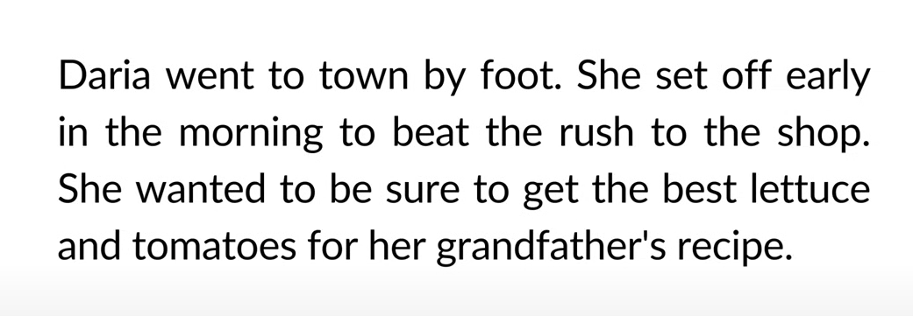
  - Now say you want the computer to scan this for words with the closest meaning , if you ask a computer to come back with a word similar to food for example , you wouldn't really except it come back with lettuce or tomatoes right? that's what a human might do but machine/computer can't.
  - A computyer is much likely to look at the words in the text lexicographically , kind of when you scroll through a dictionary & come back with foot for example , this is kind of useless to us &
  - We want to capture words `Semantics` - the branch of linguistics and logic concerned with meaning. - so the meaning behind the word.
  - Text Embeddings essentially represent that - thanks to the data captured in the super long array.
  - By creating text embedding of each word i can now find words that are similar to food in a large corpus of texts by comparing text embedding to text embedding & returning the most similar ones
    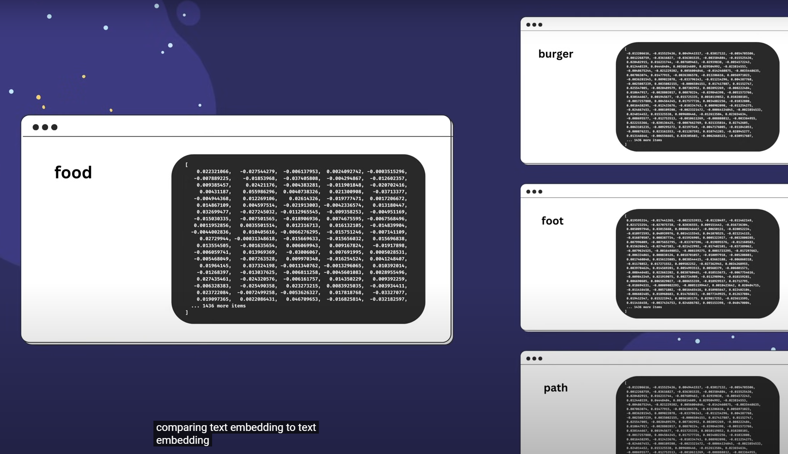
  - so words such as lettuce instead of foot will be more similar to us
  - But what even are these numbers? what does each one represent , well that actually depends on the machine learning model that generated them.
  - To help us understand how these numbers can help us find words that are similar however , let's look at this example
    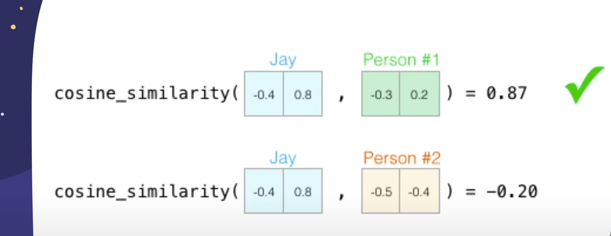
  - Imagine you're asked to conduct a personality test similar to that of the big five personality traits test that rates your following:
    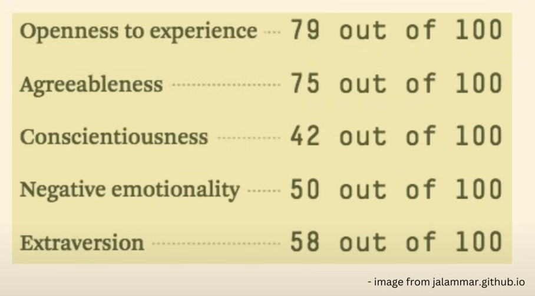
  - The test requires a score from 0 to 100 on each of these five traits in order to get a good understanding of a persons personality
  - let's start by looking at the extraversion trait first.
    - Imagine Jay gives himself a 38 out of 100 as it's introversion extraversion score , In one dimension it will look like this
      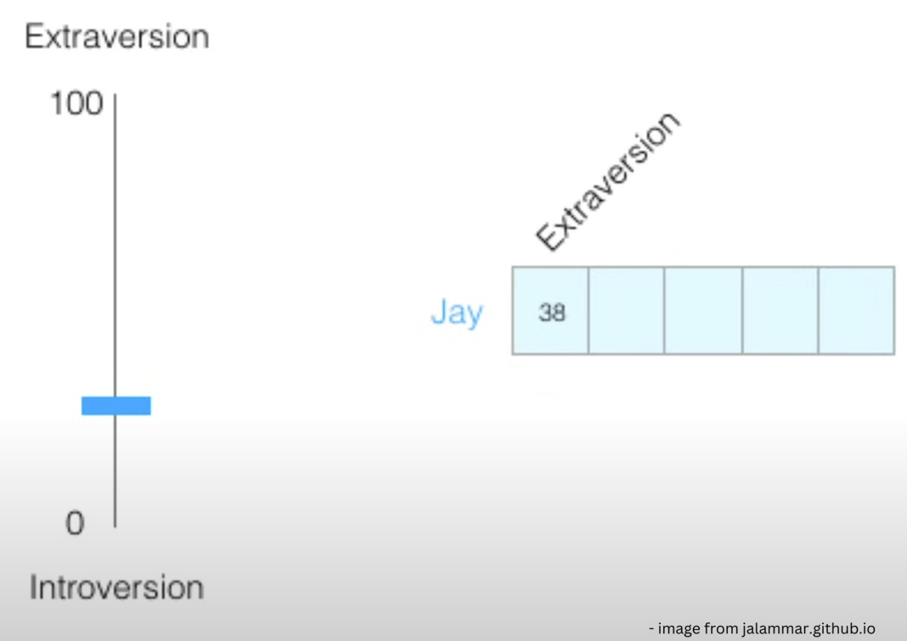
    - let's switch this out to be a score of minus one to one .
      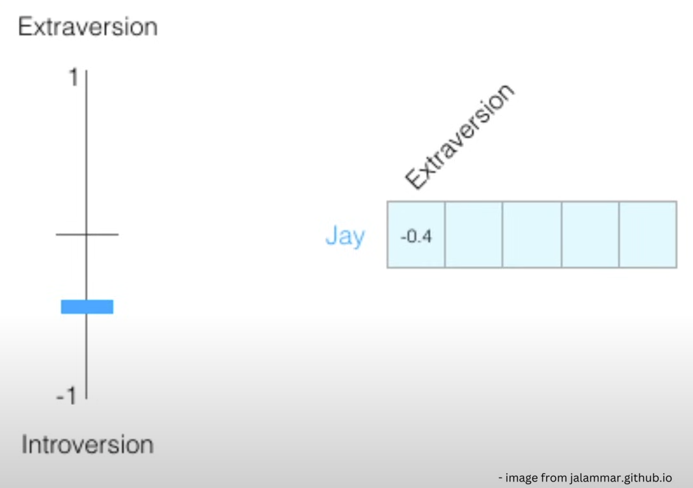
    - Now it's hard to know a person from just one personality trait
    - so let's add another trait and another dimension - the agreeableness score of a person or any of the other five traits
      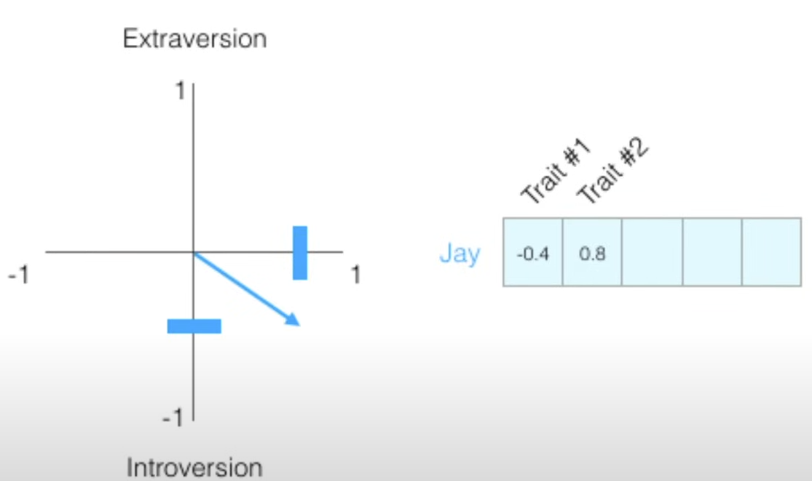
    - and we can start to get a better understanding of jay's personality.
    - now say we have three people & their personalities plotted out based on two personality traits , so we can see them on a two dimensional graph & on the right in numeric representations from -1 to 1.
      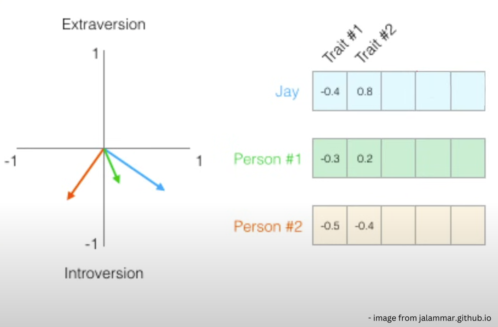
    - Now let's say jay got hit by a bus & we miss our friend and want to replace them with a person with similar personality . it's not fair but we get the idea here , when dealing with numerical values or vectors a common way to calculate a similarity score is using `cosine similarity`
      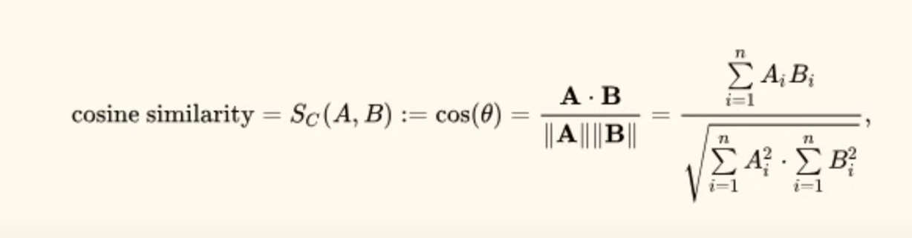
    - Using cosine simlilarity we will see person one is more similar in personality to Jay than person two
      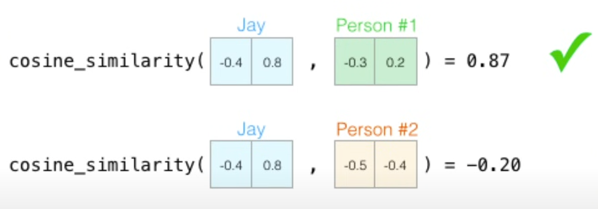
    - But still Two personality traits aren't enough , let's use all 5 trait scores, we can use five dimensions for our comparision , prob is this kind of hard to draw in first place , this is a common challenge in machine learning where we often have to think in higher dimensional space however
      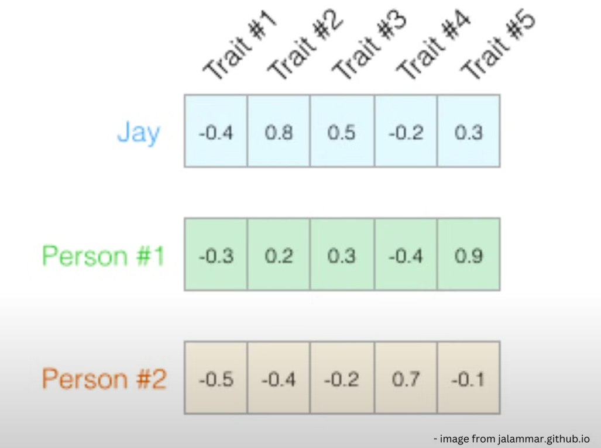
    - cosine similarity still works so we can get a numrical value by passing through the vectors for each person we want to compare to each other into the formula to get one numeric value which represents similarity.
      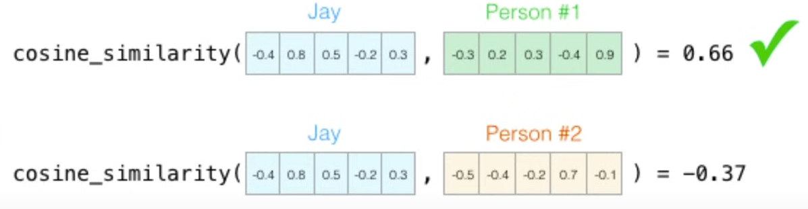
    - now we can see which person is most similar to jay
      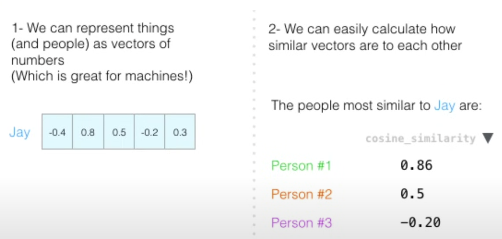
- Now we understand this concept and let's look at actual text embedding:
  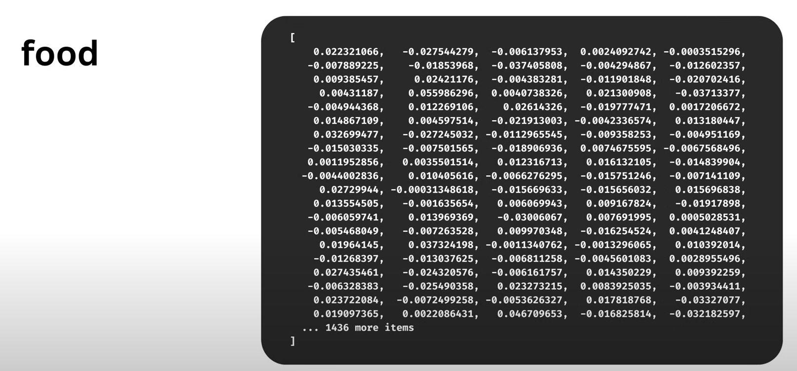
- For example the word food generated by openAI create embedding & we can it's a lot of numbers from -1 to 1. the meaning behing each numeric representation varies based on which model generates them. The other models we can use to create text embeddings are OpenAI,Word2Vec,GloVe. Now we know we can these text embeddings to compare them to other text embeddings just like we did with the above example of comparing different persons personality traits & that's a better way to do it and we can now also apply math to them and this renowed example `king-main+women = queen` and it all thanks to text embeddings, we can use code in order to pass through the words king and woman and subtract man and then we get a bunch of words returned to us each with a similarities score.
  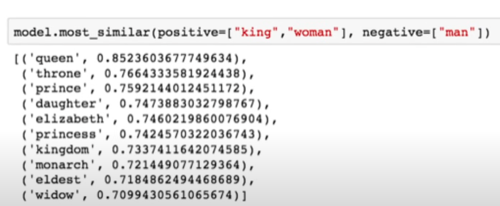
  - Queen is the most similar hence it has the highest score.

## what vector embeddings can be used for?

- vector embeddings can cover a lot more , text is just one of things that we can vectorize , we can vectorize sentences, documents , notes and graphs and images & even our faces and likewise:
  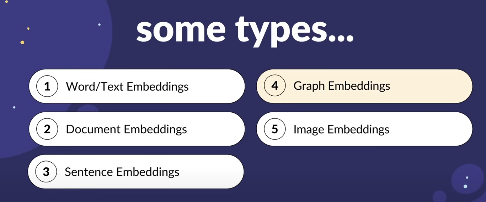
- primary applications of vector embeddings:
  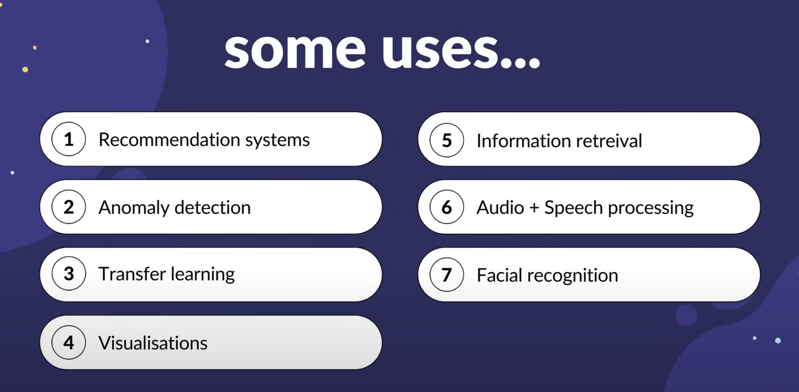
- Main take away is that core advantage of vector embeddings is that they provide a way to transfer complex multi-dimensional and often discrete data into a lower dimension continous space that captures semantic or structural relationships within the original data

## How do we generate One?

- In the Yt video they have used open ai and i will use Gemini to create embeddings -> https://ai.google.dev/gemini-api/docs/embeddings  - reference the docs always
- Install `pip install -q -U google-generativeai`
- python gemini_embedding.py gives us this:

```
python gemini_embeddings.py
[-0.050031602, -0.011258341, -0.079504654, -0.044635713, 0.013885757, 0.021160536, -0.012289658, -0.0238951, -0.010466241, 0.03615093, -0.010492937, -0.0037765617, 0.005042418, 0.008511208, -0.020700559, -0.015004925, -0.04341232, 0.029564794, -0.03199586, 0.016428895, -0.0078102355, 0.013075797, -0.024971409, 0.05849284, -0.014690404, -0.0044325925, 0.024593137, 0.026113575, 0.011644063, -0.018286578, -0.07106492, 0.040655807, -0.012871769, 0.045654282, 0.030543208, -0.044891044, -0.065672785, 0.032400224, 0.02822351, -0.097731695, -0.03839391, 0.02840921, -0.05184262, 0.025301566, 0.0031810435, -0.031728506, 0.011952043, -0.04773199, 0.04035022, 0.037007906, 0.032130603, -0.05263041, -0.030461213, 0.008568156, -0.056618176, -0.050080813, -0.027624521, -0.0057144663, 0.043062862, 0.002130037, -0.04626577, -0.014578827, 0.010504269, -0.03203156, -0.00439502, -0.07138581, -0.08438585, -0.009267279, -0.029819107, 0.070514075, 0.002540844, -0.018777287, -0.034360163, -0.022325676, 0.021852903, 0.0041984557, 0.016614089, -0.02160189, 0.019912638, 0.043609, 0.007045673, 0.0073081506, 0.07495029, 0.015926462, -0.006389848, -0.03676823, 0.030728174,
....
....
....
....]
```

- Text Embeddings is an updated version of the Embedding model that offers elastic embedding sizes under 768 dimensions. Elastic embeddings generate smaller output dimensions and potentially save computing and storage costs with minor performance loss.
- embedcontent api reference : https://ai.google.dev/api/embeddings#method:-models.embedcontent
